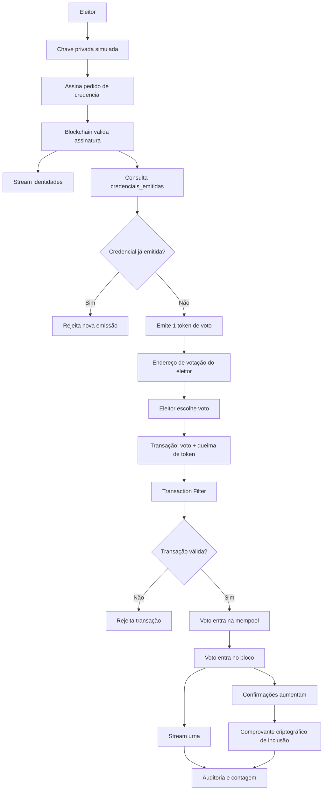

# Fluxo Completo da Votação na Blockchain

Este documento descreve o fluxo completo de uma votação descentralizada usando
MultiChain, desde o cadastro do eleitor até a apuração auditável dos votos.

A explicação foi escrita para uma banca que não conhece blockchain, portanto
combina uma linguagem didática com os elementos técnicos principais do sistema.

## Ideia Central

A blockchain funciona como um livro-caixa público, distribuído e imutável.
Cada nó autorizado da rede possui uma cópia desse livro.

No contexto da votação, a identidade do eleitor serve apenas para provar que ele
tem direito a receber uma credencial de voto. Depois disso, o voto é feito com
essa credencial, sem levar junto CPF, nome ou identidade civil.

Em outras palavras:

```text
Identidade valida o direito de votar.
Credencial anônima executa o voto.
Blockchain valida tudo sem depender de confiança externa.
```

## Atores do Sistema

### Eleitor

Pessoa que possui direito de votar.

No sistema, o eleitor possui uma chave privada que simula uma biometria. Essa
chave privada nunca é enviada para a blockchain. Ela fica sob controle do
eleitor e serve para assinar mensagens.

### Chave Privada Biométrica Simulada

Representa a biometria do eleitor no protótipo.

Como o projeto não implementa biometria real, a chave privada funciona como uma
abstração: somente o eleitor deveria possuir esse segredo.

### Chave Pública do Eleitor

É a chave pública correspondente à chave privada do eleitor.

Ela pode ser registrada na blockchain porque não revela a chave privada. Sua
função é permitir que a rede verifique se uma assinatura foi realmente feita
pelo eleitor correto.

### Master Node

É o nó administrador da rede.

Responsabilidades principais:

- criar a blockchain;
- configurar streams;
- criar assets/tokens;
- autorizar novos nós;
- cadastrar eleitores aptos;
- configurar regras de validação;
- administrar o período da eleição.

### Slave Node

É o nó auditor da rede.

Responsabilidades principais:

- manter uma cópia da blockchain;
- validar blocos e transações;
- auditar votos de forma independente;
- recalcular o resultado da eleição;
- provar que o Master Node não é a única fonte da verdade.

### Site e Backend

O site e o backend podem existir como interface de uso, mas não devem ser a
fonte de verdade do sistema.

Eles podem:

- receber comandos do usuário;
- montar transações;
- enviar transações para a blockchain;
- exibir resultados.

Eles não devem:

- decidir sozinhos quem pode votar;
- validar voto duplicado apenas fora da blockchain;
- ser a fonte final da apuração.

A integridade principal deve estar na blockchain.

## Objetos da Blockchain

### Stream `identidades`

Stream responsável por armazenar os eleitores aptos a votar.

Ela não deve armazenar CPF em texto claro.

Exemplo de registro:

```json
{
  "election_id": "ELEICAO_001",
  "voter_id_hash": "hash_do_eleitor",
  "public_key": "chave_publica_do_eleitor",
  "status": "eligible"
}
```

### Stream `credenciais_emitidas`

Stream responsável por controlar quais eleitores já receberam uma credencial de
voto para determinada eleição.

Ela evita que o mesmo eleitor se valide várias vezes para receber vários tokens.

Exemplo de registro:

```json
{
  "election_id": "ELEICAO_001",
  "voter_id_hash": "hash_do_eleitor",
  "credential_status": "issued",
  "issued_at_block": 152
}
```

### Stream `urna`

Stream responsável por armazenar os votos.

A `urna` não deve conter:

- CPF;
- nome;
- hash do CPF;
- chave pública de identidade;
- assinatura ligada diretamente à identidade civil.

Exemplo de voto:

```json
{
  "election_id": "ELEICAO_001",
  "choice": "CANDIDATO_A"
}
```

### Asset `VOTE_ELEICAO_001`

Asset nativo da MultiChain que representa uma credencial de voto.

Cada unidade desse asset funciona como uma cédula digital.

Regra principal:

```text
1 token = direito de votar 1 vez
```

Quando o eleitor vota, esse token é consumido ou enviado para um endereço de
queima. Depois disso, ele não pode ser usado novamente.

### Transaction Filter

Regra nativa da MultiChain executada antes de uma transação ser aceita.

Ela valida se a transação de voto está correta.

Exemplos de validação:

- o voto está no formato correto;
- a eleição existe;
- a eleição está aberta;
- a opção escolhida é válida;
- a transação consome exatamente 1 token da eleição;
- o token foi enviado para o destino correto;
- o voto não contém dados pessoais;
- a credencial não foi reutilizada.

### Stream Filter

Regra associada a uma stream para validar ou classificar os dados publicados.

No projeto, ela pode ser usada para validar o formato do JSON publicado na
`urna` e facilitar a auditoria.

Para impedir consenso de transações inválidas, a regra mais forte deve ser o
Transaction Filter.

### Blocos

Blocos são pacotes de transações confirmadas.

Cada bloco contém:

- transações válidas;
- timestamp;
- hash do bloco anterior;
- hash do bloco atual.

Essa ligação por hashes torna a cadeia resistente a adulterações.

### Confirmações

Uma confirmação representa um novo bloco criado depois do bloco onde está uma
transação.

Exemplo:

```text
Voto registrado no bloco 120.
Blockchain atual no bloco 123.
Confirmações do voto: 4.
```

Quanto mais confirmações, mais antigo e mais difícil de alterar é aquele
registro.

### Comprovante Criptográfico de Inclusão

Depois que o voto é registrado, o eleitor pode receber um comprovante
criptográfico de inclusão.

Esse comprovante não deve revelar em quem ele votou. Ele deve provar apenas que
uma transação de voto foi incluída na blockchain e continua íntegra.

Exemplo de comprovante:

```text
Eleição: ELEICAO_001
Transaction ID: abc123...
Bloco: 120
Hash do bloco: def456...
Hash de inclusão: 789xyz...
```

O `Hash de inclusão` pode ser calculado a partir de dados públicos da própria
blockchain, por exemplo:

```text
receipt_hash = SHA256(txid + blockhash + stream_item_id)
```

Com esse comprovante, o eleitor pode baixar ou consultar a blockchain e
verificar:

- se o `txid` existe;
- se a transação está na stream `urna`;
- se a transação entrou no bloco informado;
- se o bloco ainda possui o mesmo hash;
- se as confirmações aumentaram com o tempo.

O comprovante deve provar existência e imutabilidade, não o conteúdo político do
voto. Isso evita que ele vire uma prova transferível de "votei no candidato X",
o que poderia abrir espaço para coerção ou compra de votos.

## Fluxo Completo da Votação

## 1. Preparação da Eleição

Antes de qualquer voto, o administrador prepara a eleição na blockchain.

O Master Node cria ou configura:

```text
Stream identidades
Stream credenciais_emitidas
Stream urna
Asset VOTE_ELEICAO_001
Transaction Filters
Stream Filters
Permissões dos nós
```

Nesse momento, a rede já está fechada e permissionada. Apenas nós autorizados
participam.

O Master Node administra a rede, enquanto o Slave Node acompanha tudo de forma
independente.

Sugestão de desenho para o slide:

```text
[Master Node] cria/configura -> [identidades]
                             -> [credenciais_emitidas]
                             -> [urna]
                             -> [asset de votação]
                             -> [filtros]

[Slave Node] recebe cópia da rede e acompanha a configuração
```

Visualmente, use o Master Node à esquerda como administrador, a blockchain no
centro como um conjunto de blocos e o Slave Node à direita como auditor.

## 2. Cadastro dos Eleitores

Cada eleitor é cadastrado antes do início da votação.

O sistema recebe o CPF apenas no momento de preparação. Esse CPF não deve ser
gravado em texto claro na blockchain.

Em vez disso, é gerado um identificador criptográfico:

```text
voter_id_hash = HMAC-SHA256(CPF, segredo_da_eleicao)
```

Esse identificador permite reconhecer o direito de voto sem expor o CPF.

Depois disso, a blockchain registra na stream `identidades`:

```json
{
  "election_id": "ELEICAO_001",
  "voter_id_hash": "hash_do_eleitor",
  "public_key": "chave_publica_do_eleitor",
  "status": "eligible"
}
```

Esse registro indica:

```text
Existe um eleitor apto.
Seu CPF não está exposto.
Sua chave pública está registrada.
```

Sugestão de desenho para o slide:

```text
[CPF do eleitor] -> [HMAC-SHA256] -> [voter_id_hash]
                                      |
                                      v
                         [Stream identidades]
                         hash + chave pública + status apto
```

Mostre o CPF como um dado que entra no processo, mas não entra na blockchain.
Use uma seta passando por uma função de hash/HMAC e destaque que apenas o
identificador criptográfico é gravado.

## 3. Papel da Chave Privada

A chave privada do eleitor simula sua biometria.

Ela nunca é publicada na blockchain.

Quando o eleitor deseja participar da eleição, ele assina uma mensagem, por
exemplo:

```text
"Quero receber minha credencial para a ELEICAO_001"
```

Essa assinatura prova que o eleitor possui a chave privada correspondente à
chave pública registrada.

A blockchain valida essa assinatura usando a chave pública da stream
`identidades`.

Se a assinatura for válida, a rede sabe que:

```text
Quem fez o pedido possui a chave privada correta.
Logo, é o eleitor autorizado por aquela chave pública.
```

Sugestão de desenho para o slide:

```text
[Eleitor]
   |
   | chave privada simulada/biometria
   v
[Assinatura digital do pedido]
   |
   v
[Blockchain compara com chave pública em identidades]
```

Uma boa representação é colocar um cadeado ou chave privada do lado do eleitor
e uma chave pública dentro da blockchain. A seta deve mostrar que a chave
privada não sai do eleitor, apenas a assinatura.

## 4. Emissão da Credencial de Voto

Depois de validar a chave privada, a blockchain verifica se aquele eleitor já
recebeu uma credencial para a eleição atual.

Essa verificação ocorre na stream `credenciais_emitidas`.

Se ainda não houver registro, a blockchain permite a emissão de 1 token de voto:

```text
1 VOTE_ELEICAO_001
```

Esse token é enviado para uma carteira ou endereço controlado pelo eleitor.

Conceitualmente:

```text
Eleitor apto recebe 1 cédula digital.
```

Tecnicamente:

```text
endereco_anonimo_do_eleitor recebe 1 VOTE_ELEICAO_001
```

Em seguida, é registrado:

```json
{
  "election_id": "ELEICAO_001",
  "voter_id_hash": "hash_do_eleitor",
  "credential_status": "issued"
}
```

Esse registro impede que o mesmo eleitor tente se validar novamente para obter
outro token.

Sugestão de desenho para o slide:

```text
[Identidade validada]
        |
        v
[Consulta credenciais_emitidas]
        |
        v
[Emissão de 1 token]
        |
        v
[Carteira/endereço de votação do eleitor]
```

Para a banca, use a analogia da cédula: o eleitor autorizado recebe uma cédula
digital única. Essa cédula é o token.

## 5. Controle Contra Duplicidade na Emissão

Se o mesmo eleitor tentar se validar novamente, a blockchain executa a seguinte
lógica:

```text
Existe registro em credenciais_emitidas para esse eleitor e essa eleição?

Se não existir:
  emitir 1 token.

Se existir:
  rejeitar nova emissão.
```

Assim, o eleitor não consegue obter duas credenciais para a mesma eleição.

Essa é a primeira camada contra voto duplicado.

Sugestão de desenho para o slide:

```text
Tentativa de pedir token
        |
        v
[credenciais_emitidas]
        |
        +-- não existe registro -> emite token
        |
        +-- já existe registro -> bloqueia nova emissão
```

Use uma bifurcação com duas saídas: uma seta verde para a primeira emissão e
uma seta vermelha para a tentativa repetida.

## 6. Separação Entre Identidade e Voto

Essa é a parte mais importante da arquitetura.

A identidade é usada apenas para liberar a credencial.

O voto final não deve carregar:

- CPF;
- nome;
- hash do CPF;
- chave pública cadastrada na identidade;
- assinatura ligada diretamente à identidade civil.

O fluxo conceitual é:

```text
Identidade valida o direito de votar
        |
        v
Credencial anônima é emitida
        |
        v
Voto é feito com a credencial
```

Assim, a blockchain consegue saber que o voto é legítimo, porque ele usou uma
credencial válida, mas a urna não precisa saber quem era o eleitor.

Sugestão de desenho para o slide:

```text
Lado esquerdo: identidade
[CPF protegido] + [chave pública] -> [direito de receber token]

Lado direito: voto
[token] -> [urna]

Entre os dois lados:
[separação de identidade e voto]
```

Esse slide deve deixar claro que a identidade não entra na urna. Use uma linha
vertical ou uma barreira visual separando "fase de elegibilidade" e "fase de
votação".

## 7. Envio do Voto

Quando o eleitor escolhe uma opção, ele cria uma transação de voto.

Essa transação faz duas coisas ao mesmo tempo:

```text
1. Publica o voto na stream urna.
2. Consome ou queima exatamente 1 token VOTE_ELEICAO_001.
```

Exemplo de voto publicado:

```json
{
  "election_id": "ELEICAO_001",
  "choice": "CANDIDATO_A"
}
```

Junto com esse voto, a transação movimenta o token:

```text
1 VOTE_ELEICAO_001 -> endereço de queima
```

Isso significa que a credencial foi usada e não poderá ser reutilizada.

Sugestão de desenho para o slide:

```text
[Carteira de votação]
   |
   | envia voto + token
   v
[Transaction Filter]
   |
   +-> [Stream urna recebe escolha]
   |
   +-> [Token vai para queima]
```

Mostre a transação como uma caixa única com duas saídas: uma para a urna e outra
para a queima do token. Isso ajuda a explicar que voto e consumo da credencial
ocorrem juntos.

## 8. Controle Contra Voto Duplicado

Depois que o token é usado, o eleitor não tem mais saldo da credencial.

Antes do voto:

```text
Carteira de voto: 1 VOTE_ELEICAO_001
```

Depois do voto:

```text
Carteira de voto: 0 VOTE_ELEICAO_001
```

Se ele tentar votar novamente, a transação não terá token para consumir.

Resultado:

```text
Transação rejeitada.
```

Essa é a segunda camada contra voto duplicado.

Sugestão de desenho para o slide:

```text
Primeiro voto:
[1 token] -> [voto aceito] -> [0 tokens]

Segunda tentativa:
[0 tokens] -> [voto rejeitado]
```

Esse slide pode ser bem simples. A mensagem central é que a duplicidade é
impedida pelo saldo do token, não por uma regra escondida no backend.

## 9. Validação Antes de Entrar no Bloco

Antes de aceitar o voto, a blockchain executa regras de consenso.

O Transaction Filter verifica:

```text
O JSON do voto está correto?
A eleição existe?
A eleição está aberta?
A opção escolhida é válida?
A transação consome exatamente 1 token?
O token pertence ao asset correto?
O token foi enviado para queima?
O voto não contém dados pessoais?
```

Se todas as regras passarem, a transação é aceita.

Se qualquer regra falhar, a transação é rejeitada antes de entrar no bloco.

Sugestão de desenho para o slide:

```text
[Transação de voto]
        |
        v
[Transaction Filter]
        |
        +-- válido -> mempool
        |
        +-- inválido -> rejeitado
```

Represente o filtro como um portão de entrada da blockchain. Tudo que não
cumpre as regras fica fora do bloco.

## 10. Mempool

Após ser aceita como transação válida, o voto entra na mempool.

A mempool é uma fila temporária de transações válidas que ainda aguardam
inclusão em bloco.

De forma simples:

```text
Voto válido -> mempool -> bloco
```

Sugestão de desenho para o slide:

```text
[Voto válido 1]
[Voto válido 2]  ->  [mempool: fila de espera]  ->  [próximo bloco]
[Voto válido 3]
```

Use a mempool como uma fila ou uma caixa de espera. Isso ajuda a explicar que o
voto ainda não está definitivamente gravado até entrar em um bloco.

## 11. Criação do Bloco

O nó responsável pela mineração inclui transações válidas em um novo bloco.

Esse bloco passa a conter:

- votos válidos;
- horário aproximado;
- hash do bloco anterior;
- hash do próprio bloco.

O hash do bloco anterior é o que conecta toda a cadeia.

Se alguém altera um voto antigo, o hash daquele bloco muda. Com isso, todos os
blocos seguintes deixam de apontar corretamente para ele.

Essa é a base da imutabilidade.

Sugestão de desenho para o slide:

```text
[Bloco 120] -> [Bloco 121] -> [Bloco 122]
   hash          hash          hash
```

Dentro de cada bloco, mostre pequenos itens representando votos. Entre os
blocos, use setas chamadas "hash do bloco anterior".

## 12. Confirmações do Voto

Quando o voto entra em um bloco, ele começa a receber confirmações.

Exemplo:

```text
Voto entrou no bloco 120.
Novo bloco 121 foi criado.
Novo bloco 122 foi criado.
Novo bloco 123 foi criado.
```

Nesse caso, o voto já está enterrado na cadeia.

Quanto mais blocos vêm depois, mais difícil se torna alterar aquele voto.

Esse comportamento pode ser demonstrado para a banca com scripts de auditoria
que mostram:

- bloco atual;
- bloco onde o voto entrou;
- quantidade de confirmações;
- timestamps dos blocos;
- crescimento das confirmações ao longo do tempo.

Sugestão de desenho para o slide:

```text
Bloco 120: voto registrado
Bloco 121: +1 confirmação
Bloco 122: +2 confirmações
Bloco 123: +3 confirmações
```

Use uma linha do tempo. O voto fica no primeiro bloco e as confirmações aparecem
como camadas adicionais de segurança.

## 13. Comprovante Criptográfico para o Eleitor

Depois que o voto entra na blockchain, o eleitor pode receber um comprovante de
inclusão.

Esse comprovante funciona como um "papel digital" que permite verificar que a
transação dele existe na blockchain e não foi removida ou alterada.

Ele não deve ser o hash puro da escolha do voto, porque existem poucas opções e
alguém poderia testar todos os candidatos possíveis.

Exemplo de comprovante:

```text
Comprovante do voto
Eleição: ELEICAO_001
Transaction ID: abc123...
Bloco: 120
Hash do bloco: def456...
Hash de inclusão: 789xyz...
```

O eleitor pode guardar esse comprovante e, depois, consultar a blockchain para
verificar:

```text
Esse txid existe?
Ele está na stream urna?
Ele entrou no bloco indicado?
O bloco ainda tem o mesmo hash?
As confirmações aumentaram?
```

Isso dá ao eleitor uma prova de que seu voto foi incluído, sem revelar a opção
escolhida e sem ligar o comprovante ao CPF.

Sugestão de desenho para o slide:

```text
[Voto confirmado no bloco]
        |
        v
[Comprovante criptográfico]
        |
        +-> txid
        +-> número do bloco
        +-> hash do bloco
        +-> hash de inclusão
```

Mostre o comprovante como um recibo simples. Ao lado, mostre uma consulta na
blockchain encontrando o mesmo `txid` e confirmando que ele continua dentro do
bloco.

## 14. Apuração dos Votos

A apuração não depende de uma tela ou de um banco de dados central.

Qualquer nó autorizado pode ler a stream `urna` e somar os votos.

Exemplo:

```text
CANDIDATO_A: 10 votos
CANDIDATO_B: 7 votos
CANDIDATO_C: 3 votos
```

Mas a auditoria não olha apenas a soma.

Ela também confere:

```text
Total de votos na urna = total de tokens queimados.
Cada voto consumiu exatamente 1 token.
Nenhum voto contém dados pessoais.
Nenhum token foi usado duas vezes.
Todos os votos estão em blocos válidos.
A cadeia de hashes está íntegra.
```

Sugestão de desenho para o slide:

```text
[Stream urna] ---------> [Contagem por candidato]
[Tokens queimados] ---> [Conferência de integridade]
[Blocos] -------------> [Verificação da cadeia]
```

Mostre que a apuração é mais do que somar votos. Ela também confere se a
quantidade de votos bate com a quantidade de credenciais consumidas.

## 15. Papel do Slave Node na Auditoria

O Slave Node prova que a rede não depende apenas do Master Node.

Ele possui sua própria cópia da blockchain.

Se o Master Node apresentar um resultado, o Slave Node pode recalcular:

```text
Li todos os blocos.
Li a stream urna.
Somei os votos.
Verifiquei os tokens queimados.
Verifiquei as confirmações.
Cheguei ao mesmo resultado.
```

Isso mostra que a votação é auditável por consenso, e não apenas por confiança
em um servidor central.

Sugestão de desenho para o slide:

```text
[Master Node] -> resultado calculado
      |
      v
[Blockchain compartilhada]
      ^
      |
[Slave Node] -> recalcula e confirma o resultado
```

Esse slide deve reforçar a ideia de redundância e auditoria independente.

## Como Estruturar os Diagramas nos Slides

Uma boa apresentação pode separar o fluxo em camadas. Em vez de colocar tudo em
um único desenho, o ideal é montar uma sequência de slides progressiva, em que
cada slide adiciona uma parte da arquitetura.

## Slide 1: Visão Geral do Sistema

Objetivo do slide: mostrar o caminho completo sem entrar em detalhes técnicos.

Composição sugerida:

```text
[Eleitor] -> [Interface] -> [Blockchain MultiChain] -> [Auditoria]
```

Elementos visuais:

- eleitor à esquerda;
- site/backend como camada de entrada;
- blockchain no centro;
- Master Node e Slave Node conectados à blockchain;
- auditoria e apuração à direita.

Mensagem principal:

```text
A aplicação envia transações, mas a integridade está na blockchain.
```

## Slide 2: Preparação da Rede

Objetivo do slide: explicar que a eleição não começa do nada. A rede precisa ser
preparada.

Composição sugerida:

```text
[Master Node]
     |
     +-> cria streams
     +-> cria asset de votação
     +-> configura permissões
     +-> instala filtros

[Slave Node] -> replica e audita
```

Elementos visuais:

- Master Node como administrador;
- blocos ou caixas representando `identidades`, `credenciais_emitidas` e
  `urna`;
- asset `VOTE_ELEICAO_001` como cédula digital;
- filtros como portões de validação.

Mensagem principal:

```text
Antes da votação, a blockchain recebe as regras do processo eleitoral.
```

## Slide 3: Cadastro do Eleitor

Objetivo do slide: mostrar como a identidade é registrada sem expor CPF.

Composição sugerida:

```text
[CPF] -> [HMAC-SHA256] -> [voter_id_hash]
                             |
                             v
                  [Stream identidades]
```

Elementos visuais:

- CPF fora da blockchain;
- função criptográfica no meio;
- hash e chave pública dentro da stream `identidades`;
- ícone de privacidade ou proteção sobre o CPF.

Mensagem principal:

```text
A blockchain registra o direito de voto, mas não registra o CPF em texto claro.
```

## Slide 4: Prova Biométrica Simulada

Objetivo do slide: explicar a relação entre chave privada, chave pública e
validação.

Composição sugerida:

```text
[Chave privada do eleitor]
          |
          v
[Assinatura do pedido de credencial]
          |
          v
[Blockchain valida com chave pública cadastrada]
```

Elementos visuais:

- chave privada do lado do eleitor;
- assinatura saindo do eleitor;
- chave pública dentro da blockchain;
- validação como um selo ou marca de "válido".

Mensagem principal:

```text
A chave privada não é revelada. A rede valida apenas a assinatura.
```

## Slide 5: Emissão da Credencial Anônima

Objetivo do slide: mostrar como o eleitor recebe o direito de votar uma vez.

Composição sugerida:

```text
[Eleitor validado]
       |
       v
[credenciais_emitidas verifica duplicidade]
       |
       v
[1 token VOTE_ELEICAO_001]
       |
       v
[Endereço de votação]
```

Elementos visuais:

- stream `credenciais_emitidas` como lista de controle;
- token como cédula digital;
- carteira/endereço de votação como destino do token.

Mensagem principal:

```text
O eleitor autorizado recebe exatamente uma credencial de voto.
```

## Slide 6: Separação Entre Identidade e Urna

Objetivo do slide: deixar claro por que o voto permanece anônimo.

Composição sugerida:

```text
Fase de identidade              Fase de voto
[CPF/hash/chave pública]  ||    [token] -> [urna]
```

Elementos visuais:

- duas colunas;
- uma barreira entre as colunas;
- identidade de um lado;
- token e urna do outro;
- nenhum CPF ou chave pública indo para a urna.

Mensagem principal:

```text
A identidade libera a credencial, mas não acompanha o voto.
```

## Slide 7: Transação de Voto

Objetivo do slide: explicar que o voto e o consumo do token acontecem juntos.

Composição sugerida:

```text
[Transação de voto]
       |
       +-> publica escolha na stream urna
       |
       +-> queima 1 token de votação
```

Elementos visuais:

- uma caixa central chamada "transação";
- duas setas saindo dela;
- uma seta para a `urna`;
- outra seta para o endereço de queima.

Mensagem principal:

```text
Um voto válido precisa registrar a escolha e consumir a credencial.
```

## Slide 8: Validação por Filtro

Objetivo do slide: mostrar que a blockchain rejeita votos inválidos.

Composição sugerida:

```text
[Voto enviado] -> [Transaction Filter] -> [aceito ou rejeitado]
```

Elementos visuais:

- filtro como portão;
- seta verde para "aceito";
- seta vermelha para "rejeitado";
- lista curta de validações ao lado.

Mensagem principal:

```text
As regras críticas ficam dentro da rede, não em um sistema externo.
```

## Slide 9: Bloco e Confirmações

Objetivo do slide: explicar imutabilidade.

Composição sugerida:

```text
[Bloco 120: voto] -> [Bloco 121] -> [Bloco 122] -> [Bloco 123]
```

Elementos visuais:

- blocos em linha;
- setas com "hash do bloco anterior";
- contador de confirmações crescendo.

Mensagem principal:

```text
Cada novo bloco aumenta a confirmação e fortalece a imutabilidade do voto.
```

## Slide 10: Comprovante de Inclusão do Voto

Objetivo do slide: mostrar que o eleitor pode verificar que seu voto foi
incluído na blockchain sem revelar a escolha.

Composição sugerida:

```text
[Voto confirmado] -> [Comprovante criptográfico] -> [Consulta na blockchain]
```

Elementos visuais:

- um recibo com `txid`, bloco, hash do bloco e hash de inclusão;
- uma seta do recibo para a blockchain;
- um destaque visual mostrando "transação encontrada";
- nenhuma informação sobre candidato ou identidade civil dentro do comprovante.

Mensagem principal:

```text
O comprovante prova inclusão e imutabilidade, mas não revela em quem o eleitor votou.
```

## Slide 11: Apuração e Auditoria

Objetivo do slide: mostrar que qualquer nó pode recalcular o resultado.

Composição sugerida:

```text
[Stream urna] + [tokens queimados] + [cadeia de blocos]
             |
             v
       [Script de auditoria]
             |
             v
       [Resultado recalculado]
```

Elementos visuais:

- três fontes de dados entrando no script;
- resultado final saindo;
- Master Node e Slave Node chegando ao mesmo resultado.

Mensagem principal:

```text
O resultado não precisa ser confiado. Ele pode ser recalculado.
```

## Slide 12: Duas Barreiras Contra Duplicidade

Objetivo do slide: explicar de forma direta por que o eleitor não vota duas
vezes.

Composição sugerida:

```text
Barreira 1:
credenciais_emitidas impede receber dois tokens.

Barreira 2:
queima do token impede usar a mesma credencial duas vezes.
```

Elementos visuais:

- dois cadeados;
- primeiro cadeado na emissão da credencial;
- segundo cadeado no momento do voto.

Mensagem principal:

```text
O sistema bloqueia duplicidade antes do voto e no próprio voto.
```

## Slide 13: Resumo Final para a Banca

Objetivo do slide: fechar a explicação em uma linha narrativa.

Composição sugerida:

```text
Cadastro seguro
      |
      v
Prova biométrica simulada
      |
      v
Credencial única
      |
      v
Voto anônimo
      |
      v
Auditoria pública da blockchain
```

Mensagem principal:

```text
A blockchain garante elegibilidade, unicidade, anonimato operacional e
apuração auditável.
```

## Fluxo Resumido para Diagrama

```text
Eleitor
  |
  | usa chave privada simulada/biometria
  v
Prova de elegibilidade
  |
  v
Blockchain valida assinatura com chave pública em identidades
  |
  v
Blockchain consulta credenciais_emitidas
  |
  | se ainda não emitiu
  v
Emite 1 token VOTE_ELEICAO_001
  |
  v
Eleitor usa token para votar
  |
  v
Transação publica voto na urna + queima token
  |
  v
Transaction Filter valida regras
  |
  v
Voto entra no bloco
  |
  v
Confirmações aumentam
  |
  v
Eleitor recebe comprovante criptográfico de inclusão
  |
  v
Auditoria soma urna e confere tokens queimados
```

## Fluxo em Mermaid



## Frase de Defesa para a Banca

> Primeiro, a blockchain cadastra quem tem direito a votar, usando um
> identificador criptográfico no lugar do CPF e uma chave pública. Depois, o
> eleitor prova possuir a chave privada correspondente, que no protótipo simula
> sua biometria. A rede então libera uma credencial digital única, representada
> por um token. O voto só é aceito se consumir esse token. Assim, o sistema
> impede voto duplicado, mantém a urna sem dados pessoais e permite que qualquer
> nó auditor recalcule o resultado diretamente da blockchain. Além disso, o
> eleitor pode receber um comprovante criptográfico de inclusão para verificar
> que sua transação foi registrada, sem revelar em quem votou.

## Observação Técnica Sobre Anonimato

A separação entre identidade, credencial e voto reduz o vínculo direto entre
eleitor e escolha registrada na urna.

Para anonimato absoluto contra todos os participantes, inclusive contra quem
emite a credencial, seria necessário reforçar a etapa de entrega da credencial
com uma técnica criptográfica de credencial cega ou mecanismo equivalente.

Para o protótipo do TCC, a arquitetura principal é:

```text
Identidade prova elegibilidade.
Credencial impede duplicidade.
Urna registra apenas o voto.
Auditoria recalcula tudo pela blockchain.
```
